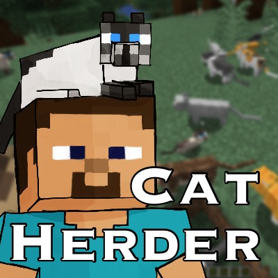

[]

# Cat Herder

## Overview

**Cat Herder** is a **Minecraft** mod made for **Minecraft Forge**.

* Special talents for your cats
* Improved AI making cats smarter than vanilla cats
* Cat statistics, kills, etc.
* Accessory system to give your cats some style
* A cat tracking and revival system

## Integrations

* [Autumnity](https://www.curseforge.com/minecraft/mc-mods/autumnity) &mdash; uses woods types for pet doors
* [Biomes O' Plenty](https://www.curseforge.com/minecraft/mc-mods/biomes-o-plenty) &mdash; uses wood types for pet doors
* [Botania](https://www.curseforge.com/minecraft/mc-mods/botania) &mdash; uses wood types for pet doors
* [Configured](https://www.curseforge.com/minecraft/mc-mods/configured) &mdash; supports dynamic configuration updates
* [Farmer's Delight](https://www.curseforge.com/minecraft/mc-mods/farmers-delight) &mdash; add crates for catnip
* [ItemPhysic](https://www.curseforge.com/minecraft/mc-mods/itemphysic) &mdash; sets physics properties for mod items
* [JEI](https://www.curseforge.com/minecraft/mc-mods/jei) &mdash; supports search for new recipes
* [Patchouli](https://www.curseforge.com/minecraft/mc-mods/patchouli) &mdash; adds the Caring for Your Cat book

## Contributing

Thanks to everyone that has contributed/helped/inspired. This includes but is not limited to...

* [Doggy Talents](https://www.curseforge.com/minecraft/mc-mods/doggy-talents) -- from which this mod borrows heavily
* [Farmer's Delight](https://www.curseforge.com/minecraft/mc-mods/farmers-delight) -- inspiration
* **Katy Schifferer** -- graphics and textures
* **Beth Schifferer** -- models and textures
* **Michelle Schifferer** -- testing and ideas

Download it from [CurseForge](https://www.curseforge.com/minecraft/mc-mods/cat-herder).

Want to know more about the mod? Take a peek at the [wiki](https://github.com/sweetrpg/CatHerder/wiki)!
